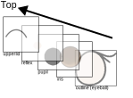

# Eye Display Module

[](https://github.com/sktometometo/eye-display/actions/workflows/main.yml)
[](https://github.com/sktometometo/eye-display/actions/workflows/full.yml)

https://github.com/user-attachments/assets/e2b44bc5-4f85-489f-b862-e851fd4cdf32

Eye Display Module

## Supported devices

1. Round Display Module with M5Stamp C3 (pio env name: `stampc3`) : https://www.switch-science.com/products/8098
2. Round Display Module with M5Stamp S3 (pio env name: `stamps3`) : https://www.switch-science.com/products/8971

## How to use

### Installation

First you have to install ROS and PlatformIO

```bash
pip install platformio
```

And then, you can build and upload the firmware to the device.

It is recommended to put this repo in a catkin workspace.

```bash
mkdir ~/catkin_ws/src
cd ~/catkin_ws
catkin init
cd ~/catkin_ws/src
git clone https://github.com/sktometometo/eye_display.git
rosdep install --from-paths . --ignore-src -y -r
catkin build eye_display
source ~/catkin_ws/devel/setup.bash
```

### Simple demo


https://github.com/user-attachments/assets/e2b44bc5-4f85-489f-b862-e851fd4cdf32


You can check basic functionalities with a demo firmware.

```bash
cd simple_version
pio run -e stampc3
pio run -e stampc3 -t uploadfs --upload-port <port to device>
pio run -e stampc3 -t upload --upload-port <port to device>
```

Then simple_version will work

Please replace `stampc3` with `stamps3` if you use type 2 device.

### rossserial/I2C version

If you want to control the device with rosserial or I2C, please use `rosserial_version` firmware.


#### rosserial version

```bash
cd rosserial_version
pio run -e stampc3-ros
pio run -e stampc3-ros -t uploadfs --upload-port <port to device>
pio run -e stampc3-ros -t upload --upload-port <port to device>
```

(Please replace `stampc3` with `stamps3` if you use type 2 device.)

And run serial node

```bash
roscore
```

```bash
rosrun rosserial_python serial_node.py _port:=<port to device> _baud:=57600
```

Then rosserial_version will work.

You can control pupil position by publish a message to "/serial_node/look_at" topic.

```bash
rostopic pub -1 /serial_node/look_at geometry_msgs/Point "{x: 1.0, y: 1.0, z: 0.0}"
```

You can control emotion expression with eye by publishing a message to "/eye_status" topic.

```bash
rostopic pub -1 /eye_status std_msgs/UInt16 "data: 0"
```

The following table shows the correspondence between the data and the emotional expression of the eyes.
Please also see [the message definition](./msg/EyeStatus.msg).

| data | emotion |
|---|---|
|0| normal |
|1| blink |
|2| surprised |
|3| sleepy |
|4| angry |
|5| sad / troubled |
|6| happy |


#### I2C version

If you want to control the device through I2C bus, please use following env.

- `stampc3-i2c-right`: Stamp C3 device on right eye
- `stampc3-i2c-left`: Stamp C3 device on left eye
- `stamps3-i2c-right`: Stamp C3 device on right eye
- `stamps3-i2c-left`: Stamp C3 device on left eye

```bash
cd rosserial_version
pio run -e <env name>
pio run -e <env name> -t uploadfs --upload-port <port to device>
pio run -e <env name> -t upload --upload-port <port to device>
```

Then you can control the device with I2C.

### Description of direction

]

### How to update image

]
